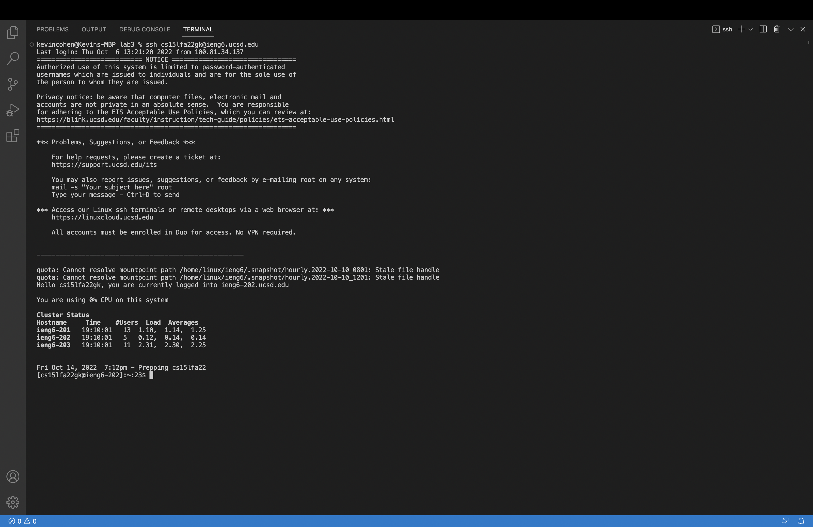
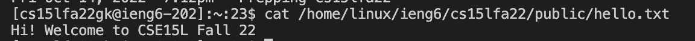
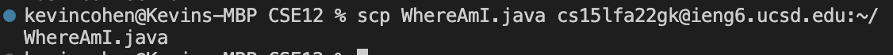

# Lab Report 1 - Remote Access and File System

> ## Step 1: Installing VSCode

I already had VSCode installed on my computer, but if you don't you can download it online at any time for free. It should look something like this once it's been installed and launched.

> ## Step 2: Remotely Connecting

To connect to a remote server you must use the 'ssh' command followed by what I believe to be the address of the remote server you are trying to access. For the purposes of CSE15L the command will look like this.

Since I've already set up an SSH Key (we'll get to that soon), I am logged into the server immediately, but you should be prepared with the password needed.

> ## Step 3: Trying Some Commands

There are many useful commands that can be used both locally and remotely. For instance, the 'cd', 'ls', 'pwd', 'mkdir', and 'cp' commands that we are familiar with running locally work on a remote server as well. Another useful command is 'cat', which shows us what is inside a given file. This is what it looks like when used on the hello.txt file.

> ## Step 4: Moving Files with 'scp'

We are also able to copy files from our computer to the remote server, which means that we can work locally and later upload it whatever server it needs to be on. We do this using the 'scp' command, which when copying the WhereAmI.java file to the remote server looks like this:

