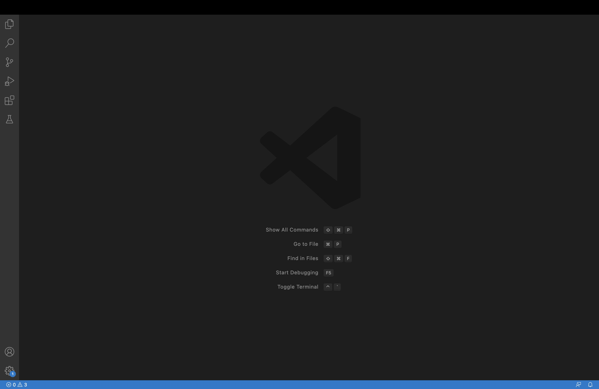

# Lab Report 1 - Remote Access and File System

> ## Step 1: Installing VSCode

I already had VSCode installed on my computer, but if you don't you can download it online at any time for free. It should look something like this once it's been installed and launched.

> ## Step 2: Remotely Connecting

To connect to a remote server you must use the 'ssh' command followed by what I believe to be the address of the remote server we are trying to access. For the purposes of CSE15L the command will look like this.
