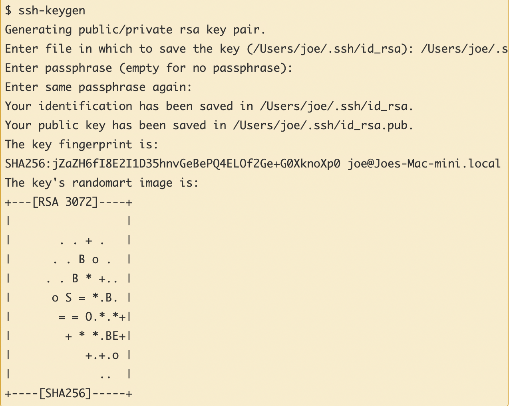

# Lab Report 1 - Remote Access and File System

> ## Step 1: Installing VSCode

I already had VSCode installed on my computer, but if you don't you can download it online at any time for free. It should look something like this once it's been installed and launched.

> ## Step 2: Remotely Connecting

To connect to a remote server you must use the 'ssh' command followed by what I believe to be the address of the remote server you are trying to access. For the purposes of CSE15L the command will look like this.

Since I've already set up an SSH Key (we'll get to that soon), I am logged into the server immediately, but you should be prepared with the password needed.

> ## Step 3: Trying Some Commands

There are many useful commands that can be used both locally and remotely. For instance, the 'cd', 'ls', 'pwd', 'mkdir', and 'cp' commands that we are familiar with running locally work on a remote server as well. Another useful command is 'cat', which shows us what is inside a given file. This is what it looks like when used on the hello.txt file.

> ## Step 4: Moving Files with 'scp'

We are also able to copy files from our computer to the remote server, which means that we can work locally and later upload it whatever server it needs to be on. We do this using the 'scp' command, which when copying the WhereAmI.java file to the remote server looks like this:

It's important to note a couple of things. You must be aware of where you are running the command from and whether you should provide a path to the file you are trying to copy. The other thing to note is that the ':~/' at the end of the command basically says to copy the file into the parent directory (i think).

> ## Step 5: Setting an SSH Key

To bypass the tedious process of inputting a password every time we access the remote server, we can utilize SSH Keys. On your computer (NOT on the remote server), use the command 'ssh-keygen' and choose an empty passphrase. Since I have already completed this step I cannot replicate it, so this is a screenshot from the course tutorial.

Once that is completed, log back into the remote server and create the .ssh directory using 'mkdir .ssh'. Then, on your computer again, you can run 'scp /Users/(your user)/.ssh/id_rsa.pub cs15lfa22(your id)@ieng6.ucsd.edu:~/.ssh/authorized_keys' to complete the process.

> ## Step 6: Optimizing Remote Running

Now that we've set up a way to work remotely there are things we can do to optimize our work. For instance we can run 'ssh cs15lfa22@ieng6.ucsd.edu "ls"' to essentially login to the remote server and run ls in the home directory in just one command line. We can also run multiple commands in one line using semicolons as such: 'cp WhereAmI.java OtherMain.java; javac OtherMain.java; java WhereAmI'.
