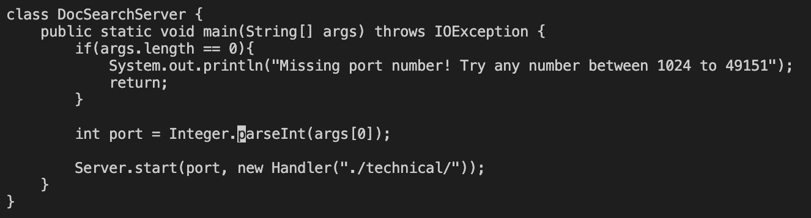
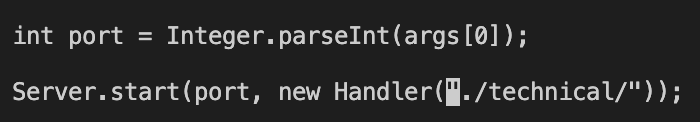

# Lab Report 4

> ## Part 1:
For the Week 6 lab, my group chose to change the main method to take a command-line argument. We did it using the following key presses:
```
/pars<Enter>y$/"<Enter>d$"0pi))<<<<delete>1<esc>:wq
```
After entering vim for DocSearch.java, typing /pars<Enter> brought me to this place in the code.

  
  
Using y$ copies the rest of the line we're on, while /"<Enter> brings us here.
  
  
  
  Using d$ deletes the rest of the line, leaving us with this.
  
  
  
  "0p pastes what we originally copied, not what we just deleted.
  
  
  
  Entering insert mode with i, I added two parenthesis, used arrow keys to go left three times, and then deleted the 0 replacing it with a one leaving us with this final result:
  
  
  
  Lastly use <esc> to exit insert mode, and :wq to save and quit.
  
> ## Part 2

  Making the edit in VSC and then copying it over to the remote server to be tested there took me a minute and 46 seconds. Making the edit through vim already being logged into the remote server took a minute and 24 seconds, which was noticeably faster. I am already used to using VSC, and am nowhere near as comfortable using vim, and yet the latter was faster. This shows me the potential vim has, as I can imagine it will only become more efficient the more I use it and get used to it. There would be a slight learned curve, however, as I still am unaware of most vim commands and won't know what to use and when I should use it.
